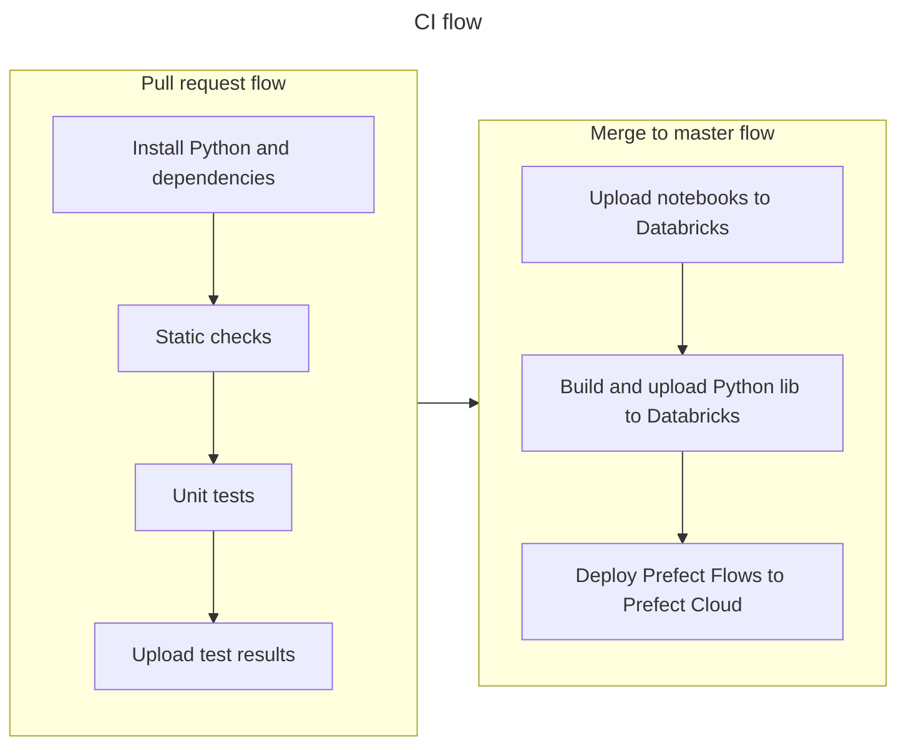

[](https://github.com/alex7c4/databricks_pipelines/actions/workflows/deploy.yml)

Training project to make Prefect managed Databricks pipelines.

CI _(GitHub Actions)_ will run checks, tests and deploy the notebooks to the Databricks server and Prefect Flows to a Prefect Cloud.

> [!NOTE]
> This project is still in WIP

---
### Pre-requirements

Following things will be needed:
- [Prefect Cloud](https://app.prefect.cloud/) account
- [Azure](https://portal.azure.com/) account (For _'Azure Databricks'_ and _'Azure Blob Storage'_)

### Setup environment

1) Setup Azure Databricks and create token for your account.
2) Create container `flows` in Azure Storage.
3) Prepare `.env` file from an [`.env_template`](.env_template): `cp .env_template .env` and fill your secrets.
4) Launch local Prefect Agent and Prefect CLI with `docker compose`:
    ```shell
    docker compose up --remove-orphans --force-recreate --pull always

    # To cleanup after:
    # docker compose down --rmi all --volumes
    # docker system prune --all --volumes --force  # warning! removes all images and volumes!
    ```
5) Register your storage as a Block into a Prefect Cloud:
    ```shell
    docker exec -it databricks_pipelines-cli-1 python3 src/flows/maintenance/make_block_remote_storage.py
    ```
6) Deploy two existing flows _(also will be done by CI)_:
    ```shell
    docker exec -it databricks_pipelines-cli-1 bash -c "python3 one.py && python3 two.py"
    # or manually:
    docker exec -it databricks_pipelines-cli-1 bash
    ```

Now you should be able to trigger Databricks jobs from Prefect Cloud UI.

### CI flow
GitHub Actions CI/CD flow defined under [`.github/workflows`](.github/workflows):

